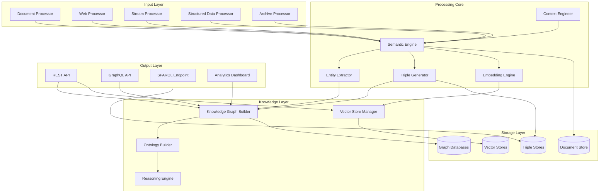

# Design Document

## Overview

SemantiCore is designed as a modular, scalable semantic intelligence platform built with a microservices architecture. The system transforms unstructured data into intelligent knowledge graphs, vector embeddings, and semantic structures through a pipeline-based processing approach. The platform emphasizes modularity, extensibility, and production-ready scalability while maintaining high semantic processing quality.

## Architecture

### High-Level Architecture



### Core Components Architecture

The system follows a layered architecture with clear separation of concerns:

1. **Input Layer**: Handles diverse data sources and formats
2. **Processing Core**: Performs semantic analysis and intelligence extraction
3. **Knowledge Layer**: Constructs and manages knowledge representations
4. **Output Layer**: Provides APIs and interfaces for data access
5. **Storage Layer**: Manages persistent storage across multiple backends

## Components and Interfaces

### 1. Document Processing Module

**Purpose**: Process various document formats with full semantic understanding

**Key Classes**:
- `DocumentProcessor`: Main processing coordinator
- `PDFProcessor`: Specialized PDF processing with OCR support
- `OfficeProcessor`: Handle DOCX, XLSX, PPTX files
- `ScientificProcessor`: Process LaTeX, BibTeX, JATS XML
- `ArchiveProcessor`: Handle ZIP, TAR, RAR archives

**Interfaces**:
```python
class IDocumentProcessor:
    def process(self, file_path: str, options: ProcessingOptions) -> ProcessedDocument
    def extract_metadata(self, document: Document) -> DocumentMetadata
    def extract_structure(self, document: Document) -> DocumentStructure
    def extract_content(self, document: Document) -> ContentBlocks
```

### 2. Semantic Engine

**Purpose**: Core semantic processing and intelligence extraction

**Key Classes**:
- `SemanticEngine`: Main semantic processing coordinator
- `EntityExtractor`: Named entity recognition and extraction
- `RelationshipDetector`: Identify relationships between entities
- `TripleGenerator`: Generate RDF triples from content
- `ContextBuilder`: Build and preserve contextual information

**Interfaces**:
```python
class ISemanticEngine:
    def extract_semantics(self, content: Content, options: SemanticOptions) -> SemanticData
    def extract_entities(self, text: str) -> List[Entity]
    def detect_relationships(self, entities: List[Entity], context: Context) -> List[Relationship]
    def generate_triples(self, semantic_data: SemanticData) -> List[Triple]
```

### 3. Knowledge Graph Builder

**Purpose**: Construct and manage knowledge graphs from semantic data

**Key Classes**:
- `KnowledgeGraphBuilder`: Main graph construction coordinator
- `GraphDatabase`: Abstract interface for graph database operations
- `Neo4jConnector`: Neo4j-specific implementation
- `BlazegraphConnector`: Blazegraph-specific implementation
- `GraphAnalyzer`: Perform graph analytics and metrics

**Interfaces**:
```python
class IKnowledgeGraphBuilder:
    def build_graph(self, semantic_data: List[SemanticData]) -> KnowledgeGraph
    def add_nodes(self, nodes: List[Node]) -> None
    def add_relationships(self, relationships: List[Relationship]) -> None
    def query_graph(self, query: GraphQuery) -> QueryResult
    def analyze_graph(self) -> GraphAnalytics
```

### 4. Vector Store Manager

**Purpose**: Handle vector embeddings and semantic search

**Key Classes**:
- `VectorStoreManager`: Coordinate vector operations
- `EmbeddingEngine`: Generate contextual embeddings
- `SemanticChunker`: Intelligent content segmentation
- `SimilarityEngine`: Semantic similarity and search
- `VectorDatabase`: Abstract interface for vector stores

**Interfaces**:
```python
class IVectorStoreManager:
    def create_embeddings(self, content: List[str], options: EmbeddingOptions) -> List[Vector]
    def store_vectors(self, vectors: List[Vector], metadata: List[Metadata]) -> None
    def semantic_search(self, query: str, options: SearchOptions) -> List[SearchResult]
    def find_similar(self, vector: Vector, threshold: float) -> List[SimilarityResult]
```

### 5. Stream Processor

**Purpose**: Handle real-time data streams and live processing

**Key Classes**:
- `StreamProcessor`: Main streaming coordinator
- `KafkaConnector`: Kafka integration
- `RabbitMQConnector`: RabbitMQ integration
- `FeedMonitor`: RSS/Atom feed monitoring
- `WebMonitor`: Website change detection

**Interfaces**:
```python
class IStreamProcessor:
    def configure_stream(self, config: StreamConfig) -> None
    def start_processing(self) -> None
    def process_batch(self, messages: List[Message]) -> List[ProcessedMessage]
    def handle_real_time(self, message: Message) -> ProcessedMessage
```

## Data Models

### Core Data Models

```python
@dataclass
class Document:
    id: str
    content: str
    metadata: DocumentMetadata
    structure: DocumentStructure
    format: str
    source: str
    timestamp: datetime

@dataclass
class Entity:
    id: str
    text: str
    type: EntityType
    confidence: float
    position: TextPosition
    attributes: Dict[str, Any]

@dataclass
class Relationship:
    id: str
    source_entity: Entity
    target_entity: Entity
    relation_type: RelationType
    confidence: float
    context: Context

@dataclass
class Triple:
    subject: str
    predicate: str
    object: str
    confidence: float
    source: str
    context: Context

@dataclass
class SemanticData:
    entities: List[Entity]
    relationships: List[Relationship]
    triples: List[Triple]
    context: Context
    metadata: SemanticMetadata

@dataclass
class KnowledgeGraph:
    nodes: List[Node]
    edges: List[Edge]
    schema: GraphSchema
    metadata: GraphMetadata
    analytics: GraphAnalytics
```

### Configuration Models

```python
@dataclass
class ProcessingOptions:
    extract_tables: bool = True
    extract_images: bool = True
    preserve_structure: bool = True
    enable_ocr: bool = False
    language_detection: bool = True

@dataclass
class SemanticOptions:
    entity_types: List[EntityType]
    confidence_threshold: float = 0.7
    context_window: int = 512
    enable_reasoning: bool = True

@dataclass
class EmbeddingOptions:
    model: str
    dimension: int
    preserve_context: bool = True
    chunking_strategy: ChunkingStrategy
```

## Error Handling

### Error Hierarchy

```python
class SemantiCoreException(Exception):
    """Base exception for all SemantiCore errors"""
    pass

class ProcessingException(SemantiCoreException):
    """Errors during document processing"""
    pass

class SemanticException(SemantiCoreException):
    """Errors during semantic analysis"""
    pass

class StorageException(SemantiCoreException):
    """Errors during data storage operations"""
    pass

class ConfigurationException(SemantiCoreException):
    """Configuration and setup errors"""
    pass
```

### Error Handling Strategy

1. **Graceful Degradation**: System continues processing other documents when individual documents fail
2. **Retry Logic**: Automatic retry with exponential backoff for transient failures
3. **Circuit Breaker**: Prevent cascade failures in distributed components
4. **Error Reporting**: Comprehensive error logging and monitoring
5. **Recovery Mechanisms**: Automatic recovery from common failure scenarios

### Logging and Monitoring

```python
class ProcessingMonitor:
    def log_processing_start(self, document_id: str) -> None
    def log_processing_complete(self, document_id: str, metrics: ProcessingMetrics) -> None
    def log_error(self, error: Exception, context: Dict[str, Any]) -> None
    def update_metrics(self, metrics: Dict[str, float]) -> None
    def check_health(self) -> HealthStatus
```

## Testing Strategy

### Unit Testing

- **Coverage Target**: 90%+ code coverage
- **Test Framework**: pytest with fixtures and mocks
- **Component Testing**: Each module tested in isolation
- **Mock Strategy**: Mock external dependencies (databases, APIs)

### Integration Testing

- **Database Integration**: Test with real database instances
- **API Testing**: End-to-end API testing with real data
- **Pipeline Testing**: Full processing pipeline validation
- **Performance Testing**: Load testing with realistic data volumes

### Quality Assurance

```python
class QualityValidator:
    def validate_entity_extraction(self, results: List[Entity]) -> ValidationResult
    def validate_triple_generation(self, triples: List[Triple]) -> ValidationResult
    def validate_knowledge_graph(self, graph: KnowledgeGraph) -> ValidationResult
    def validate_semantic_consistency(self, data: SemanticData) -> ValidationResult
```

### Test Data Management

- **Synthetic Data**: Generated test data for various scenarios
- **Real Data Samples**: Curated real-world data samples
- **Edge Cases**: Specific test cases for edge conditions
- **Performance Benchmarks**: Standardized performance test suites

### Continuous Testing

- **Automated Testing**: CI/CD pipeline with automated test execution
- **Regression Testing**: Prevent quality degradation over time
- **Performance Monitoring**: Continuous performance benchmarking
- **Quality Metrics**: Track semantic processing quality over time

## Performance Considerations

### Scalability Design

1. **Horizontal Scaling**: Stateless processing components for easy scaling
2. **Distributed Processing**: Support for multi-node processing clusters
3. **Caching Strategy**: Multi-level caching for frequently accessed data
4. **Resource Management**: Efficient memory and CPU utilization
5. **Load Balancing**: Intelligent load distribution across processing nodes

### Optimization Strategies

1. **Batch Processing**: Efficient batch processing for high-throughput scenarios
2. **Parallel Processing**: Multi-threaded and multi-process execution
3. **Memory Management**: Streaming processing for large documents
4. **Database Optimization**: Optimized queries and indexing strategies
5. **Network Optimization**: Efficient data transfer and compression

### Performance Monitoring

```python
class PerformanceMonitor:
    def track_processing_time(self, operation: str, duration: float) -> None
    def track_memory_usage(self, component: str, memory_mb: float) -> None
    def track_throughput(self, documents_per_second: float) -> None
    def generate_performance_report(self) -> PerformanceReport
```

## Security Design

### Data Protection

1. **Encryption**: AES-256-GCM encryption for data at rest and in transit
2. **Key Management**: Integration with AWS KMS, Azure Key Vault, HashiCorp Vault
3. **Access Control**: Role-based access control (RBAC) with fine-grained permissions
4. **Audit Logging**: Comprehensive audit trails for all operations

### Privacy Compliance

1. **PII Detection**: Automatic detection and handling of personally identifiable information
2. **Data Anonymization**: Configurable anonymization strategies
3. **Compliance Frameworks**: GDPR, HIPAA, CCPA compliance features
4. **Data Governance**: Data lineage, classification, and retention policies

### Security Monitoring

```python
class SecurityMonitor:
    def detect_anomalies(self, activity: UserActivity) -> List[Anomaly]
    def validate_access(self, user: User, resource: Resource) -> AccessResult
    def log_security_event(self, event: SecurityEvent) -> None
    def generate_security_report(self) -> SecurityReport
```