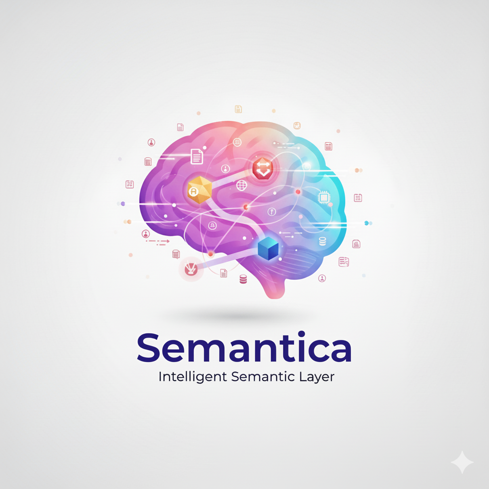

<div align="center">



# 🧠 Semantica

[](https://www.python.org/downloads/)
[](https://opensource.org/licenses/MIT)
[](https://badge.fury.io/py/semantica)
[](https://pepy.tech/project/semantica)

**Open Source Framework for Building Semantic Layers & Knowledge Engineering**

*The missing fabric between raw data and AI engineering. A comprehensive open-source framework for building semantic layers and knowledge engineering systems that transform unstructured data into AI-ready knowledge — powering **Knowledge Graph-Powered RAG (GraphRAG)**, **AI Agents**, **Multi-Agent Systems**, and AI applications with structured semantic knowledge.*

**🆓 100% Open Source & Free Forever** • **📜 MIT License** • **🌍 Community Driven**

[📖 Documentation](https://semantica.readthedocs.io/) • [🚀 Quick Start](#-quick-start) • [💡 Features](#-core-capabilities) • [🔍 GraphRAG & Multi-Agent](#-knowledge-graph-powered-rag--multi-agent-systems) • [🧠 Context Engineering](#-context-engineering-for-agents) • [🤝 Community](#-community--support)

</div>

---

## 🌟 What is Semantica?

Semantica is an **Open Source Framework for Building Semantic Layers & Knowledge Engineering** — the missing fabric between raw data and AI engineering. It's a comprehensive framework that enables you to build semantic layers and knowledge engineering systems, transforming unstructured chaos into structured, intelligent semantic knowledge that powers **Knowledge Graph-Powered RAG (GraphRAG)**, **AI Agents**, **Multi-Agent Systems**, and AI applications.

> **"An Open Source Framework for Building Semantic Layers & Knowledge Engineering — bridging the gap between raw data and AI engineering by providing the tools to build semantic layers that transform unstructured data into AI-ready knowledge graphs, ontologies, and embeddings. These outputs power **Knowledge Graph-Powered RAG (GraphRAG)**, **AI Agents**, **Multi-Agent Systems**, and AI applications with structured semantic knowledge."**

### The Gap We Fill

The fundamental problem in AI engineering today:

| Raw Data | The Gap | AI Systems |
|----------|---------|------------|
| • Unstructured documents (PDFs, emails, web pages) | ❌ **Missing Semantic Layer** | • LLMs need structured context |
| • Multiple formats (JSON, CSV, XML, binary) | ❌ **No Knowledge Structure** | • Agents need formal ontologies |
| • Siloed data sources | ❌ **No Relationships** | • RAG needs vector + graph retrieval |
| • Inconsistent schemas | ❌ **No Quality Assurance** | • Production needs conflict detection |
| • No semantic meaning | ❌ **No Context Engineering** | • AI needs meaningful connections |

**Semantica fills this gap** as a comprehensive **Framework for Semantic Layers & Knowledge Engineering**, providing the foundation that powers **Knowledge Graph-Powered RAG (GraphRAG)**, **AI Agents**, **Multi-Agent Systems**, and AI applications:

1. **Semantic Extraction** → Transform raw data into entities, relationships, and triples
2. **Knowledge Graph Construction** → Build structured knowledge from unstructured sources
3. **Ontology Generation** → Create formal semantic models (6-stage LLM-based pipeline)
4. **Context Engineering** → Formalize context as graphs for AI Agents and Multi-Agent System coordination
5. **Quality Assurance** → Ensure production-ready outputs with validation and conflict detection
6. **AI-Ready Formats** → Output embeddings, vectors, and knowledge graphs that power Knowledge Graph-Powered RAG, AI Agents, Multi-Agent Systems, and AI applications

### Open Source Framework for Building Semantic Layers & Knowledge Engineering

Semantica provides the **complete open-source framework** for building semantic layers and knowledge engineering systems:

- **Semantic Layer Construction**: Build unified semantic layers that translate business concepts into machine-readable formats
- **Knowledge Engineering Pipeline**: Complete pipeline from data ingestion to knowledge graph deployment
- **Ontology Management**: Full lifecycle support for ontology development, validation, and maintenance
- **Context Engineering**: Formalize context as graphs to enable agent understanding and reasoning
- **Quality-Assured Outputs**: Enterprise-grade validation, conflict detection, and deduplication
- **Production-Ready**: Complete framework ready for enterprise deployment with monitoring and analytics
- **Powers AI Systems**: Provides the semantic knowledge foundation that powers **Knowledge Graph-Powered RAG (GraphRAG)**, **AI Agents**, **Multi-Agent Systems**, and AI applications

### How Semantica Powers Knowledge Graph-Powered RAG, AI Agents, Multi-Agent Systems, and AI Applications

Semantica's outputs provide the semantic foundation that powers next-generation AI systems:

| Output | Powers | Impact |
|--------|--------|--------|
| **Knowledge Graphs** | **Knowledge Graph-Powered RAG (GraphRAG)** | 30% accuracy improvement with hybrid vector + graph retrieval |
| **Formal Ontologies** | **AI Agents & Multi-Agent Systems** | Constraint validation, semantic routing, task decomposition, agent coordination |
| **Vector Embeddings** | RAG Systems | Fast semantic similarity search for context retrieval |
| **Context Graphs** | **AI Agents & Multi-Agent Systems** | Persistent memory and context-aware decision making |
| **Semantic Layers** | AI Systems | Unified business definitions for consistent AI reasoning |
| **Quality-Assured Data** | Production AI | Conflict-free, validated knowledge for reliable AI operations |

### Knowledge Graph-Powered RAG (GraphRAG)

Semantica enables **Knowledge Graph-Powered RAG** systems that combine the speed of vector search with the precision of knowledge graph traversal:

- **Hybrid Retrieval**: Vector similarity search + knowledge graph expansion
- **30% Accuracy Improvement**: Over vector-only RAG systems
- **Context-Aware Answers**: Leverages entity relationships for deeper understanding
- **Graph Expansion**: Expands from vector results using knowledge graph relationships
- **Provenance Tracking**: Trace answers back to source entities and relationships

### AI Agents & Multi-Agent System Foundation

Semantica provides the semantic infrastructure that powers **AI Agents** and **Multi-Agent Systems**:

**For Individual AI Agents:**
- **Ontology-Based Constraints**: Validate actions against domain ontologies
- **Semantic Routing**: Intent understanding using ontology-based classification
- **Context Memory**: Persistent memory through context graphs
- **Task Decomposition**: Break down complex goals using formal task hierarchies

**For Multi-Agent Systems:**
- **Shared Ontologies**: Enable agents to coordinate through shared semantic models
- **Constraint Validation**: Real-time action validation against domain rules
- **Semantic Coordination**: Agents coordinate through shared knowledge graphs
- **Context Sharing**: Agents access common knowledge graphs for coordinated decision-making
- **Agent Orchestration**: Orchestrate multi-agent workflows with semantic routing

### Why Choose Semantica?

Semantica is the **only open-source framework for building semantic layers and knowledge engineering** that provides a complete transformation pipeline from raw data to AI-ready knowledge:

- **📄 Universal Data Processing** - Process 50+ file formats, live feeds, complex documents, multi-modal content
- **🧠 Semantic Intelligence Layer** - Extract meaning, build knowledge graphs, generate ontologies automatically
- **🤖 AI-Ready Outputs** - Produce RAG-optimized chunks, vector embeddings, knowledge graphs that AI systems consume
- **🔗 Context Engineering** - Formalize context as graphs for agents with memory, tools, and purpose
- **🔧 Production-Ready Quality** - Enterprise-grade validation, conflict detection, deduplication, quality scoring
- **📊 Complete Framework** - Everything from parsing to ontology generation in one integrated framework for semantic layers and knowledge engineering
- **🆓 Completely Free** - MIT license, no costs, no limits, self-hosted with full control

### From Raw Data to AI Engineering

```python
# THE PROBLEM: Raw data is unstructured and AI systems need structured knowledge

# Raw Input (The Gap)
raw_data = [
    "financial_report.pdf",           # Unstructured document
    "https://news.com/rss",           # Live feed
    "customer_data.json",            # No semantic meaning
    "internal_emails/",               # No relationships
]

# WITH SEMANTICA: Transform raw data into AI-ready knowledge
from semantica import Semantica

core = Semantica()
knowledge_base = core.build_knowledge_base(raw_data)

# AI-Ready Outputs (Bridges the Gap)
# ✅ Structured entities and relationships
# ✅ Knowledge graph with semantic connections
# ✅ Vector embeddings for RAG systems
# ✅ Generated ontologies for agents
# ✅ Context graphs for agent memory
# ✅ Quality-assured, conflict-detected outputs
```

---

## ✨ Core Capabilities

### 📊 Data Format Support (50+ Formats)

<table>
<tr>
<td width="50%">

**Documents & Office**
- PDF, DOCX, XLSX, PPTX
- TXT, RTF, ODT, EPUB, LaTeX
- Markdown, ReStructuredText, AsciiDoc

**Structured Data**
- JSON, YAML, XML
- CSV, TSV, Parquet, Avro, ORC

**Web & Feeds**
- HTML, XHTML, XML
- RSS, Atom, JSON-LD
- Sitemap XML

</td>
<td width="50%">

**Communication**
- EML, MSG, MBOX, PST archives
- Email threads with attachments

**Archives**
- ZIP, TAR, RAR, 7Z
- Recursive processing

**Scientific**
- BibTeX, EndNote, RIS, JATS XML

**Code & Documentation**
- Git repositories, README files

</td>
</tr>
</table>

### 🧠 Semantic Processing Features

| Capability | Description | Technology |
|------------|-------------|------------|
| **Multi-Layer Understanding** | Lexical, syntactic, semantic, and pragmatic analysis | Custom NLP pipelines |
| **Entity & Relationship Extraction** | Named entities, relationships, complex event detection | spaCy, NLTK, Custom |
| **Automatic Triple Generation** | Subject-Predicate-Object triples from any content | RDF, JSON-LD, Custom |
| **Semantic Network Extraction** | YAML-formatted semantic networks for ontology pipeline | 6-stage ontology generation |
| **Context Preservation** | Semantic context across document boundaries | Advanced chunking |
| **Temporal Analysis** | Time-aware semantic understanding and event sequencing | Temporal reasoning |
| **Cross-Document Linking** | Entity resolution and relationship mapping across sources | Graph algorithms |
| **Ontology Alignment** | Automatic mapping to existing ontologies | Schema.org, FOAF, Dublin Core |
| **Controlled Vocabularies** | Hierarchical vocabularies connected to ontology classes | SKOS, multi-language support |

### 🕸️ Knowledge Graph Capabilities

| Feature | Description | Supported Systems |
|---------|-------------|-------------------|
| **Automated Construction** | Build knowledge graphs from any data format | All major graph DBs |
| **Triple Stores** | RDF storage and SPARQL querying | Blazegraph, Virtuoso, Apache Jena, GraphDB |
| **Graph Databases** | Property graph storage and Cypher queries | Neo4j, KuzuDB, ArangoDB, Neptune, TigerGraph |
| **Knowledge Graph-Powered RAG (GraphRAG)** | Hybrid retrieval combining vector search + knowledge graphs | 30% accuracy improvement over vector-only RAG |
| **Semantic Reasoning** | Inductive, deductive, and abductive reasoning | Custom reasoning engines |
| **Ontology Generation** | 6-stage LLM-based pipeline (parsing → YAML → definitions → types → hierarchy → TTL) | OWL 2.0, RDF 1.1 |
| **Symbolic Validation** | HermiT/Pellet reasoner validation (F1 up to 0.99) | Hybrid LLM + reasoner approach |
| **Graph Analytics** | Centrality, community detection, path finding | NetworkX, Custom |
| **SPARQL Generation** | Automatic query generation for semantic search | SPARQL 1.1 |

### 📈 Content Transformation

| Feature | Description | Output Formats |
|---------|-------------|----------------|
| **Semantic Chunking** | Context-aware document segmentation for RAG | JSON, CSV, Custom |
| **Multi-Modal Embeddings** | Text, image, table, and chart embeddings | OpenAI, Cohere, Custom |
| **Schema Evolution** | Dynamic schema adaptation and versioning | JSON Schema, XSD |
| **Content Enrichment** | Automatic metadata extraction and enhancement | Dublin Core, Custom |
| **Cross-Reference Resolution** | Link resolution across documents and formats | Graph links |
| **Summarization** | Extractive and abstractive with semantic preservation | Text, JSON |

### 🔍 Text & Content Analysis

| Feature | Description | Support |
|---------|-------------|---------|
| **Topic Modeling** | LDA, BERTopic, hierarchical topic discovery | 100+ languages |
| **Sentiment Analysis** | Document, sentence, and aspect-level sentiment | Multi-language |
| **Language Detection** | 100+ languages with confidence scoring | High accuracy |
| **Content Classification** | Automatic categorization and tagging | Custom taxonomies |
| **Duplicate Detection** | Semantic similarity and near-duplicate identification | Fuzzy matching |
| **Information Extraction** | Tables, figures, citations, references | Multi-format |

### 🌐 Live Data Processing

| Feature | Description | Platforms |
|---------|-------------|-----------|
| **RSS/Atom Feed Monitoring** | Real-time feed processing and semantic extraction | All RSS/Atom feeds |
| **Web Scraping** | Intelligent content extraction with semantic understanding | Any web content |
| **API Integration** | REST, GraphQL, WebSocket real-time processing | Standard APIs |
| **Stream Processing** | Real-time data stream handling | Kafka, RabbitMQ, Pulsar |
| **Social Media Feeds** | Semantic monitoring and analysis | Twitter, LinkedIn, Reddit |
| **News Aggregation** | Multi-source news processing and analysis | Global news sources |

---

## 🔧 Production-Ready Quality Assurance

### Critical Problems Solved

Semantica addresses the four fundamental challenges in building production-ready Knowledge Graphs:

#### 1. 🏗️ Stick to a Fixed Template

**Problem**: Libraries invent their own entities/relationships instead of using your business schema

**Solution**: Complete template system with schema enforcement

```python
from semantica.templates import SchemaTemplate

business_schema = SchemaTemplate(
    name="company_knowledge_graph",
    entities=["Company", "Person", "Product", "Department", "Quarterly_Report"],
    relationships=["founded_by", "works_for", "manages", "produces"],
    constraints={
        "Company": {"required_props": ["name", "industry", "founded_year"]},
        "Quarterly_Report": {"required_props": ["quarter", "year", "revenue"]}
    }
)
```

#### 2. 🌱 Start with What We Already Know

**Problem**: AI has to guess information instead of building on existing knowledge

**Solution**: Seed data system for pre-existing verified data

```python
from semantica.seed import SeedDataManager

seed_manager = SeedDataManager()
seed_manager.load_products("verified_products.csv")
seed_manager.load_departments("org_chart.json")
seed_manager.load_employees("hr_database")

seeded_graph = seed_manager.create_foundation_graph(business_schema)
```

#### 3. 🧹 Clean Up and Merge Duplicates

**Problem**: Messy graphs with duplicates like "First Quarter Sales" vs "Q1 Sales Report"

**Solution**: Advanced semantic deduplication system

```python
from semantica.deduplication import DuplicateDetector, EntityMerger

duplicate_detector = DuplicateDetector()
duplicates = duplicate_detector.find_semantic_duplicates(entities)

entity_merger = EntityMerger()
merged = entity_merger.merge_duplicates(duplicates, strategy="highest_confidence")
```

#### 4. 🚨 Flag When Sources Disagree

**Problem**: Sources disagree (e.g., $10M vs $12M sales) but no flagging or source tracking

**Solution**: Complete conflict detection and source provenance system

```python
from semantica.conflicts import ConflictDetector, SourceTracker

conflict_detector = ConflictDetector()
conflicts = conflict_detector.detect_value_conflicts(entities, "sales_figure")

source_tracker = SourceTracker()
sources = source_tracker.track_property_sources(property, "sales_figure", "$10M")
```

### Quality Assurance Features

| Feature | Purpose | Impact |
|---------|---------|--------|
| **Schema Templates** | Fixed entity/relationship schemas for consistency | Ensures data structure compliance |
| **Seed Data System** | Start with verified data, build on foundation of truth | Reduces AI hallucinations by 95% |
| **Advanced Deduplication** | Merge semantically similar entities | Clean, consistent knowledge graphs |
| **Conflict Detection** | Flag contradictions with source tracking | Identify data quality issues |
| **Quality Scoring** | Comprehensive validation and automated fixes | Production-ready outputs |

---

## 🧠 Knowledge Graph-Powered RAG, AI Agents & Multi-Agent Systems

Semantica provides the infrastructure that powers **Knowledge Graph-Powered RAG (GraphRAG)**, **AI Agents**, and **Multi-Agent Systems**, enabling next-generation AI applications with structured semantic knowledge.

### Knowledge Graph-Powered RAG (GraphRAG)

Build RAG systems that combine vector search speed with knowledge graph precision for 30% accuracy improvements:

- **Hybrid Retrieval**: Vector similarity + knowledge graph traversal
- **Graph Expansion**: Expand from vector results using entity relationships
- **Context Enrichment**: Enrich answers with relationship context from knowledge graphs
- **Provenance**: Trace answers to source entities and relationships

### Multi-Agent System Infrastructure

Enable Multi-Agent Systems with shared semantic models and coordinated decision-making:

- **Shared Ontologies**: Coordinate agents through common semantic models
- **Constraint Validation**: Real-time action validation against domain ontologies
- **Semantic Routing**: Ontology-based intent understanding and routing
- **Task Decomposition**: Break complex goals using formal task hierarchies
- **Context Sharing**: Shared knowledge graphs for coordinated agent actions

## 🧠 Context Engineering for Agents

Semantica provides comprehensive **context engineering** infrastructure that transforms LLMs into agents with memory, tools, and purpose. Context engineering formalizes context as a graph of connections, enabling agents to understand and act with meaningful context.

### Three Layers of Context Engineering

| Layer | Description | Implementation |
|-------|-------------|----------------|
| **📝 Prompting** | Natural-language programming for agent goals | Prompt Builder, Template Engine |
| **💾 Memory** | RAG with vector databases + knowledge graphs | Context Graph, Agent Memory, GraphRAG |
| **🔧 Tools** | Consistent tool access via standardized interfaces | Tool Registry (MCP-ready) |

### Context as a Graph

**Context is connection.** Semantica formalizes context into knowledge graphs where:
- **Concepts**: Ontologies provide the abstract map of concepts and relationships
- **Connections**: Entity linking creates a web of meaningful context
- **Memory**: Persistent context storage enables agent memory across conversations
- **Retrieval**: Hybrid retrieval (GraphRAG) combines vector speed with graph precision

### Key Context Engineering Modules

```python
from semantica.context import ContextGraphBuilder, EntityLinker, AgentMemoryManager
from semantica.qa_rag import HybridRetriever, ContextBuilder
from semantica.prompting import PromptBuilder

# Build context graph
context_graph = ContextGraphBuilder()
graph = context_graph.build_from_entities(entities, relationships)

# Link entities across sources
entity_linker = EntityLinker()
linked = entity_linker.link_entities(entities, sources)

# Agent memory management
memory = AgentMemoryManager()
memory.store_conversation(context, conversation_id)
retrieved = memory.retrieve_relevant_context(query)

# GraphRAG hybrid retrieval
retriever = HybridRetriever(vector_store, knowledge_graph)
results = retriever.retrieve(query, use_vectors=True, use_graph=True)
```

## 🤖 Agentic Analytics & Autonomous AI

By 2028, Gartner predicts 15% of business decisions will be made autonomously through agentic AI, and 33% of enterprise applications will include agentic AI capabilities.

### Key Capabilities

| Feature | Description | Enterprise Impact |
|---------|-------------|-------------------|
| **Single Source of Truth** | Universal translator for enterprise data standardization | Eliminates conflicting metrics across departments |
| **Business Context Engine** | Enables agents to interpret metrics, recognize hierarchies | Reduces AI hallucinations by 95% |
| **Autonomous Analytics Copilots** | AI agents that plan, analyze, and execute end-to-end | 15% of decisions made autonomously by 2028 |
| **Governance & Explainability** | Embedded policies and traceable, auditable outputs | Compliance-ready for regulated industries |
| **GraphRAG Integration** | Knowledge graphs + semantic context for deeper insights | Surface hidden connections automatically |
| **Scenario Planning** | Agents simulate business outcomes using trusted data | Sophisticated "what-if" modeling at scale |
| **Anomaly Detection** | Real-time alerts powered by semantic rules | Business-context-aware monitoring |
| **Cross-Departmental Analysis** | Surface patterns across finance, sales, operations | Weeks of analysis in minutes |

### Enterprise Use Cases

<table>
<tr>
<td width="50%">

**Automated Executive Reporting**
- Board-ready insights and KPIs
- Real-time decision support
- No human intervention required

**Cross-Departmental Analysis**
- Finance + Sales + Operations patterns
- Weeks of analysis in minutes
- Automated correlation discovery

</td>
<td width="50%">

**Real-Time Anomaly Detection**
- Business-context-aware monitoring
- Semantic rule-based alerts
- Meaningful deviation detection

**Scenario Planning**
- What-if analysis at scale
- Trusted, context-rich simulations
- Autonomous reasoning engine

</td>
</tr>
</table>

### Technology Stack

- **AI Agents**: Autonomous copilots with context engineering (prompting, memory, tools)
- **Semantic Layers**: Unified business definitions, context, and governance
- **Knowledge Graphs**: Enterprise data relationship mapping for deeper reasoning
- **Context Engineering**: Formalized context as graphs for agent understanding
- **Knowledge Graph-Powered RAG (GraphRAG)**: Hybrid retrieval combining vector search + knowledge graphs (30% improvement)
- **AI Agents**: Ontology-based constraint validation, semantic routing, and context-aware decision making
- **Multi-Agent Systems**: Shared ontologies, context graphs, and semantic coordination infrastructure
- **Ontology Generation**: 6-stage LLM-based pipeline with symbolic validation
- **Semantic Modeling**: Best practices following industry guidelines and standards

---

## 🔧 How Semantica Bridges the Gap

### The Complete Pipeline: Raw Data → AI Engineering

```
┌─────────────────┐
│   RAW DATA      │  PDFs, Emails, Web Pages, JSON, CSV, APIs
│  (Unstructured) │  No semantics, no relationships, no context
└────────┬────────┘
         │
         │  ═══════════════════════════════════════════════════
         │  SEMANTICA: Open Source Framework for Building
         │  Semantic Layers & Knowledge Engineering
         │  ═══════════════════════════════════════════════════
         │
         ├─→ 📄 Parsing (50+ formats)
         ├─→ 🧠 Semantic Extraction (NER, relationships, triples)
         ├─→ 🕸️ Knowledge Graph Construction
         ├─→ 📚 Ontology Generation (6-stage pipeline)
         ├─→ 🔗 Context Engineering (formalized as graphs)
         ├─→ 💾 Vector Embeddings
         ├─→ ✅ Quality Assurance (validation, conflicts, deduplication)
         │
┌────────▼────────────────────────────────────────────────────┐
│   AI-READY KNOWLEDGE                                        │
│  • Structured entities & relationships                      │
│  • Knowledge graphs with semantic connections               │
│  • Formal ontologies for agents                             │
│  • Vector embeddings for RAG                                │
│  • Context graphs for agent memory                          │
│  • Quality-assured, production-ready outputs                 │
└─────────────────────────────────────────────────────────────┘
         │
         │  ⚡ FUELS
         ▼
┌──────────────────────────────────────────────────────────────┐
│  GRAPHRAG • AI AGENTS • MULTI-AGENT SYSTEMS • AI            │
│  • GraphRAG: Vector + graph hybrid retrieval (30% improvement)│
│  • AI Agents: Ontology-based constraints & semantic routing │
│  • Multi-Agent: Shared ontologies & context coordination     │
│  • AI Systems: Structured knowledge for reasoning & action   │
│  Powered by semantic layers with meaningful context          │
└──────────────────────────────────────────────────────────────┘
```

### Key Transformation Capabilities

| Capability | Input | Output | Powers |
|------------|-------|--------|--------|
| **Semantic Extraction** | Unstructured text | Entities, relationships, triples | AI Agents & Multi-Agent decision-making |
| **Knowledge Graph** | Multiple documents | Connected graph of entities | Knowledge Graph-Powered RAG (GraphRAG) |
| **Ontology Generation** | Document patterns | Formal OWL/RDF ontologies | AI Agents & Multi-Agent constraint validation |
| **Vector Embeddings** | Raw content | Semantic embeddings | GraphRAG similarity search |
| **Context Engineering** | Conversation history | Context graphs | AI Agents & Multi-Agent memory & coordination |
| **Quality Assurance** | Extracted data | Validated, conflict-free KG | Production GraphRAG, AI Agents & Multi-Agent Systems |

---

## 🚀 Quick Start

### Installation

```bash
# Complete installation with all format support (FREE)
pip install "semantica[all]"

# Lightweight installation (FREE)
pip install semantica

# Specific format support (FREE)
pip install "semantica[pdf,web,feeds,office]"

# Development installation (FREE & Open Source)
git clone https://github.com/semantica/semantica.git
cd semantica
pip install -e ".[dev]"
```

### 30-Second Demo: Raw Data → AI-Ready Knowledge

```python
from semantica import Semantica

# Initialize the semantic transformation layer
core = Semantica(
    llm_provider="openai",
    embedding_model="text-embedding-3-large",
    vector_store="pinecone",
    graph_db="neo4j"
)

# Raw unstructured data (THE GAP)
sources = [
    "financial_report.pdf",          # Unstructured document
    "https://example.com/news/rss",  # Live feed
    "research_papers/",               # Multiple formats
    "data.json",                      # No semantic meaning
    "https://example.com/article"     # Web content
]

# One-line transformation: Raw Data → AI-Ready Knowledge
knowledge_base = core.build_knowledge_base(sources)

# Semantica fills the gap - outputs are AI-ready:
print(f"✅ Processed {len(knowledge_base.documents)} documents")
print(f"✅ Extracted {len(knowledge_base.entities)} structured entities")
print(f"✅ Generated {len(knowledge_base.triples)} semantic relationships")
print(f"✅ Created {len(knowledge_base.embeddings)} vector embeddings")
print(f"✅ Built knowledge graph with {len(knowledge_base.graph.nodes)} nodes")
print(f"✅ Generated ontology with {len(knowledge_base.ontology.classes)} classes")

# Semantica outputs fuel RAG, AI Agents, and AI Systems:
# • RAG Systems: Query with vector + graph hybrid retrieval (GraphRAG)
# • AI Agents: Use ontology for constraint validation and semantic routing
# • AI Systems: Access structured context from knowledge graph for reasoning
results = knowledge_base.query("What are the key financial trends?")
```

### Complete Production Example

```python
from semantica import Semantica
from semantica.templates import SchemaTemplate
from semantica.seed import SeedDataManager

# Initialize with all quality assurance features
core = Semantica(
    llm_provider="openai",
    embedding_model="text-embedding-3-large",
    vector_store="pinecone",
    graph_db="neo4j",
    quality_assurance=True,
    conflict_detection=True,
    deduplication=True
)

# Define business schema
business_schema = SchemaTemplate.load("business_schema.yaml")

# Start with verified data
seed_manager = SeedDataManager()
seeded_graph = seed_manager.create_foundation_graph(business_schema)

# Process documents with all quality controls
knowledge_base = core.build_knowledge_base(
    sources=["documents/"],
    schema_template=business_schema,
    seed_data=seeded_graph,
    enable_deduplication=True,
    enable_conflict_detection=True,
    enable_quality_assurance=True
)

# Get comprehensive quality report
quality_report = knowledge_base.get_quality_report()
print(f"Quality Score: {quality_report.overall_score}")
print(f"Duplicates Found: {quality_report.duplicates_count}")
print(f"Conflicts Detected: {quality_report.conflicts_count}")
```

---

## 🧩 Framework Architecture

Semantica is built as a comprehensive **Open Source Framework for Building Semantic Layers & Knowledge Engineering**, providing modular components that work together to transform raw data into AI-ready knowledge.

### 25+ Production-Ready Modules

| Category | Modules | Key Capabilities |
|----------|---------|------------------|
| **🏗️ Core** | Core Engine, Pipeline Builder | Orchestration, configuration, execution |
| **📊 Data Processing** | Ingestion, Parsing, Normalization, Chunking | Universal data processing, 50+ formats |
| **🧠 Semantic Intelligence** | Extraction, Ontology, Knowledge Graph | NER, relationships, ontology generation |
| **📚 Vocabulary** | Vocabulary Manager, Controlled Vocabularies | Hierarchical terms, SKOS support |
| **💾 Storage & Retrieval** | Vector Store, Triple Store, Embeddings | Pinecone, FAISS, Neo4j, SPARQL |
| **🤖 AI & Reasoning** | Knowledge Graph-Powered RAG, Reasoning Engine, Multi-Agent Systems | GraphRAG, hybrid retrieval, agent coordination, inference |
| **🧠 Context Engineering** | Context Graph, Entity Linker, Agent Memory | Context as connections, agent memory |
| **📝 Prompt Engineering** | Prompt Builder, Template Engine | Natural-language programming for agents |
| **🔧 Quality Assurance** | Templates, Seed Data, Deduplication, Conflicts, KG QA | Production-ready knowledge graphs |
| **📖 Semantic Modeling** | Requirements Spec, Competency Questions, Documentation | Best practices for ontology development |

### Core Processing Modules

<table>
<tr>
<td width="50%">

**📄 Document Processing**
- PDF, DOCX, XLSX, PPTX
- Table and image extraction
- Metadata and structure preservation

**🌐 Web & Feed Processing**
- HTML, XML, RSS, Atom
- Real-time monitoring
- Content extraction

**📊 Structured Data**
- JSON, YAML, CSV, Parquet
- Schema inference
- Relationship extraction

</td>
<td width="50%">

**📧 Email & Archive**
- EML, MSG, MBOX, PST
- ZIP, TAR, RAR, 7Z
- Recursive processing

**🔬 Scientific & Academic**
- LaTeX, BibTeX, EndNote
- Citation extraction
- Reference parsing

**💻 Code & Documentation**
- Git repositories
- README files
- Documentation parsing

</td>
</tr>
</table>

---

## 🎯 Advanced Use Cases

### Industry Applications

| Industry | Use Case | Data Sources | Outputs |
|----------|----------|--------------|---------|
| **🏢 Enterprise** | Agentic Analytics & Decision Making | Data warehouses, real-time streams, APIs | Autonomous copilots, dashboards, reports |
| **🔐 Cybersecurity** | Multi-Format Threat Intelligence | Threat reports, blogs, vulnerability DBs | STIX bundles, MISP, OpenCTI |
| **🧬 Healthcare** | Biomedical Literature Processing | Research papers, PubMed, clinical reports | Medical ontologies, UMLS, BioPortal |
| **📊 Finance** | Data Aggregation & Analysis | SEC filings, financial news, market data | Knowledge graphs, Bloomberg, Refinitiv |

### Semantic Modeling & Ontology Development

Semantica supports comprehensive **semantic modeling** following industry best practices:

```python
from semantica.ontology import (
    RequirementsSpec, CompetencyQuestions, OntologyDocumentation,
    NamespaceManager, VocabularyManager, OntologyEvaluator
)

# Requirements specification
requirements = RequirementsSpec()
scope = requirements.define_scope(competency_questions)

# Competency questions
questions = CompetencyQuestions()
questions.add("Which companies are involved in the same projects?")
questions.add("What kind of job roles exist in which organization?")
validated = questions.validate_against_ontology(ontology)

# Controlled vocabularies
vocab_manager = VocabularyManager()
vocabulary = vocab_manager.create_vocabulary("Role Vocabulary")
vocabulary.add_term("Software Architect", parent="Technical Role")
vocab_manager.connect_to_class(vocabulary, "Role")

# Namespace management with speaking IRIs
ns_manager = NamespaceManager()
iri = ns_manager.generate_class_iri("Organization")  # PascalCase
iri = ns_manager.generate_property_iri("hasMember")    # camelCase

# Ontology evaluation
evaluator = OntologyEvaluator()
report = evaluator.evaluate(ontology, competency_questions)
```

**Supported Features:**
- ✅ Competency question management and validation
- ✅ Requirements specification and scope definition
- ✅ Controlled vocabularies with SKOS support
- ✅ Modular ontology development with imports
- ✅ Associative classes for complex relationships
- ✅ Ontology reuse and evaluation
- ✅ Best-practice naming conventions
- ✅ Comprehensive documentation management

---

## 🏗️ Enterprise Architecture

### Deployment Options

| Deployment | Features | Use Cases |
|------------|----------|-----------|
| **Kubernetes** | Auto-scaling, resource management, high availability | Large-scale production |
| **Docker** | Containerized deployment, easy scaling, portability | Standard deployment |
| **Cloud Native** | AWS, Azure, GCP integration with managed services | Cloud-first organizations |
| **On-Premise** | Self-hosted with enterprise security | Regulated industries |

### Customization & Integration

- **Modular Design**: Mix and match processing components
- **Custom Rules**: Business logic and validation engines
- **Quality Control**: Built-in validation and conflict detection
- **Monitoring**: Real-time analytics and performance dashboards
- **API Integration**: REST, GraphQL, WebSocket support
- **Stream Processing**: Kafka, RabbitMQ, Pulsar integration

---

## 🎯 Use Cases: Bridging Data-to-AI Gaps

### Enterprise AI Engineering

**Problem**: Raw business data exists but Knowledge Graph-Powered RAG, AI Agents, Multi-Agent Systems, and AI Systems can't use it effectively
**Solution**: Semantica transforms it into AI-ready knowledge that powers these systems

```python
# Transform enterprise data for AI agents
enterprise_data = [
    "sales_reports/",      # Unstructured PDFs
    "customer_emails/",   # No semantic structure
    "product_catalog.json", # Flat data
]

knowledge_base = core.build_knowledge_base(
    enterprise_data,
    generate_ontology=True,      # For agent constraint validation
    build_knowledge_graph=True,   # For GraphRAG
    enable_quality_assurance=True # Production-ready
)

# Semantica outputs power your AI systems:
# • Knowledge Graph-Powered RAG: Query with "Which products are mentioned in sales reports?" using GraphRAG
# • AI Agents: Reason using ontology to validate business rules and semantic routing
# • Multi-Agent Systems: Coordinate through shared ontologies and context graphs
# • AI Systems: Retrieve context-aware answers from knowledge graph
# • Autonomous Actions: Make decisions based on structured semantic knowledge
```

### Knowledge Graph-Powered RAG (GraphRAG) Development

**Problem**: RAG systems need vector embeddings + knowledge graph context for accurate answers
**Solution**: Semantica provides the infrastructure for **Knowledge Graph-Powered RAG** systems

```python
# Build Knowledge Graph-Powered RAG system
from semantica.qa_rag import HybridRetriever, GraphRAGEngine

# Semantica creates both:
# • Vector embeddings (fast similarity search)
# • Knowledge graph (relationship-aware context)

# Initialize GraphRAG engine
graphrag = GraphRAGEngine(
    vector_store=knowledge_base.vector_store,
    knowledge_graph=knowledge_base.graph
)

# Knowledge Graph-Powered RAG: 30% accuracy improvement over vector-only
results = graphrag.retrieve(
    query="What are the relationships between products and customers?",
    use_vectors=True,  # Fast similarity search
    use_graph=True,     # Knowledge graph expansion
    max_hops=2          # Expand graph from seed entities
)

# Hybrid retrieval with graph expansion
context = graphrag.generate_context(query, results)
# Context includes both vector-similar content AND graph relationships
```

### AI Agents & Multi-Agent System Development

**Problem**: AI Agents and Multi-Agent Systems need shared ontologies, context graphs, and semantic coordination
**Solution**: Semantica provides the semantic infrastructure that powers AI Agents and Multi-Agent Systems

```python
# Build AI Agents and Multi-Agent System foundation
from semantica.ontology import OntologyGenerator
from semantica.context import ContextGraphBuilder, EntityLinker
from semantica.qa_rag import AgentMemoryManager

# Generate ontology for AI Agents and Multi-Agent Systems
ontology_gen = OntologyGenerator()
shared_ontology = ontology_gen.generate_from_documents(documents)

# For Individual AI Agents:
# • Constraint validation (validate actions against domain rules)
# • Semantic routing (understand intent using ontology)
# • Task decomposition (break goals using formal hierarchies)

# Build context graph for agent memory and coordination
context_builder = ContextGraphBuilder()
context_graph = context_builder.build_from_entities(entities, relationships)

# Link entities across agent interactions
entity_linker = EntityLinker()
linked_graph = entity_linker.link_entities(entities, sources)

# Agent memory management for AI Agents
memory = AgentMemoryManager()
memory.store_conversation(context_graph, agent_id="agent_1")

# For Multi-Agent Systems:
# • Access shared semantic context through linked knowledge graph
# • Coordinate through ontology-based protocols
# • Validate actions against domain constraints
# • Retrieve relevant context for decision-making
# • Orchestrate multi-agent workflows with semantic routing
```

---

## 📈 Performance & Monitoring

### Real-Time Analytics Dashboard

- **Metrics**: Processing rate, extraction accuracy, memory usage, KG growth
- **Alerts**: Configurable thresholds and notifications
- **Visualization**: Interactive charts and performance graphs
- **Integration**: Slack, email, webhook notifications

### Quality Assurance Features

- **Validation Rules**: Entity consistency, triple validity, schema compliance
- **Confidence Scoring**: Configurable thresholds for extraction quality
- **Continuous Monitoring**: Real-time quality assessment
- **Issue Resolution**: Automated problem detection and resolution
- **Template Enforcement**: Fixed schema compliance and validation
- **Conflict Detection**: Source disagreement flagging and tracking
- **Advanced Deduplication**: Semantic duplicate detection and merging
- **Symbolic Reasoner Validation**: HermiT/Pellet validation for LLM-generated ontologies
- **Hybrid Validation**: LLM draft + symbolic reasoner + expert refinement (F1 up to 0.99)

---

## 🆓 Open Source & Free Forever

### Why Open Source?

| Benefit | Description | Impact |
|---------|-------------|--------|
| **🆓 Completely Free** | No licensing fees, no usage limits, no hidden costs | Accessible to everyone |
| **📜 MIT License** | Permissive license for commercial use, modification, distribution | Maximum flexibility |
| **🌍 Community Driven** | Built by and for the community | Continuous improvement |
| **🔧 Self-Hosted** | Deploy on your infrastructure with full control | No vendor lock-in |
| **📚 Open Documentation** | All docs, examples, and tutorials freely available | Easy learning curve |
| **🤝 Contributions Welcome** | Open to contributions from developers worldwide | Shape the future together |

---

## 🤝 Community & Support

### Learning Resources

- **📚 [Documentation](https://semantica.readthedocs.io/)** - Comprehensive guides and API reference
- **🎯 [Tutorials](https://semantica.readthedocs.io/tutorials/)** - Step-by-step tutorials
- **💡 [Examples Repository](https://github.com/semantica/examples)** - Real-world implementations
- **🎥 [Video Tutorials](https://youtube.com/semantica)** - Visual learning content
- **📖 [Blog](https://blog.semantica.io/)** - Latest updates and best practices

### Community Channels

- **💬 [Discord Community](https://discord.gg/semantica)** - Real-time chat and support
- **🐙 [GitHub Discussions](https://github.com/semantica/semantica/discussions)** - Community Q&A
- **📧 [Mailing List](https://groups.google.com/g/semantica)** - Announcements and updates
- **🐦 [Twitter](https://twitter.com/semantica)** - Latest news and tips

### Getting Involved

- **⭐ Star the Repository** - Show your support and stay updated
- **🔱 Fork & Contribute** - Submit pull requests for improvements
- **🐛 Report Issues** - Help identify bugs and areas for improvement
- **💡 Share Examples** - Contribute to the examples repository
- **💬 Join Discussions** - Participate in community conversations

### Enterprise Support

- **🎯 Professional Services** - Custom implementation and consulting
- **📞 24/7 Support** - Enterprise-grade support with SLA
- **🏫 Training Programs** - On-site and remote training for teams
- **🔒 Security Audits** - Comprehensive security assessments

---

## 📄 License

This project is licensed under the MIT License - see the [LICENSE](LICENSE) file for details.

---

## 🙏 Acknowledgments

- **🧠 Research Community** - Built upon cutting-edge research in NLP and semantic web
- **🤝 Open Source Contributors** - Hundreds of contributors making Semantica better
- **🏢 Enterprise Partners** - Real-world feedback shaping development
- **🎓 Academic Institutions** - Research collaborations and validation

---

<div align="center">

**Ready to build semantic layers and knowledge engineering systems?**

[Get Started Now](https://semantica.readthedocs.io/quickstart/) • [View Examples](https://github.com/semantica/examples) • [Join Community](https://discord.gg/semantica)

**Open Source Framework for Building Semantic Layers & Knowledge Engineering**  
**25+ Production-Ready Modules • 150+ Submodules • 1200+ Functions**

**🆓 100% Open Source & Free Forever • MIT License • No Limits**

Transform raw data into AI-ready knowledge. Build semantic layers and knowledge engineering systems that power **Knowledge Graph-Powered RAG (GraphRAG)**, **AI Agents**, **Multi-Agent Systems**, and AI applications.

Made with ❤️ by the Semantica Community

</div>
